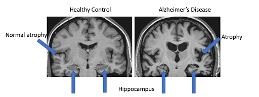

Artificial intelligence (AI) is emerging as a promising solution to improve the diagnosis and treatment of Alzheimer's disease, a neurodegenerative disorder that impairs cognitive functions. Despite advancements in traditional techniques, such as magnetic resonance imaging (MRI) neuroimaging, the integration of AI with cognitive data could revolutionize early diagnosis and the prediction of disease progression. This study aims to review the scientific literature to analyze the most current approaches combining neuroimaging and cognitive data, identifying gaps in existing research and defining the most promising methodologies for developing effective predictive models and targeted therapies.

### The Fight Against Alzheimer's: Current State and Perspectives

Dementia affects approximately 55 million people worldwide, with Alzheimer's disease being the most common form, accounting for 60-70% of all cases [[1]](#alzheimer-ref). It is a progressive neurodegenerative disorder that primarily impairs cognitive functions, leading to a decline in memory, reasoning, and behavior. This process is due to specific brain alterations, including the abnormal accumulation of proteins like beta-amyloid and tau. Despite its high prevalence, no definitive cure has yet been found. This underscores the importance of early diagnosis, which would allow for the adoption of more effective management strategies, providing tangible benefits to patients, their families, and caregivers.

New frontiers in Alzheimer's research include advanced techniques in molecular genetics and the application of artificial intelligence. The latter is transforming the way information is processed, enabling early diagnosis even up to six years before the appearance of symptoms such as memory deterioration.

### How Artificial Intelligence Can Support Alzheimer's Diagnosis

Artificial intelligence (AI) can improve the diagnosis of Alzheimer's disease in several ways, increasing the precision, speed, and personalization of clinical assessments. For example, through machine learning and deep learning techniques, AI can analyze brain neuroimages obtained through MRI and PET scans, detecting even the slightest structural brain alterations, often with accuracy equal to or surpassing that of human specialists [[2]](#alzheimer-ref). Additionally, AI provides crucial support to researchers in discovering new biomarkers and developing targeted therapies, accelerating scientific progress.

The image displays a physiologically healthy brain on the left and the brain of an individual diagnosed with Alzheimer's disease on the right. While a certain degree of cerebral atrophy is a natural consequence of aging, the pronounced volumetric reduction observed in the scan on the right indicates significant neuronal loss. This degeneration may be attributed to the accumulation of amyloid plaques and neurofibrillary tangles, which disrupt neuronal function and ultimately lead to cell death. Additionally, the hippocampus (highlighted by blue arrows) appears to be severely affected, suggesting potential impairments in the formation of new memories and the acquisition of new skills [[7]](#alzheimer-ref).

### The Current State of Research

Several studies conducted in the United States have highlighted the potential of Artificial Intelligence in the diagnosis and management of Alzheimer’s disease.

The first study, conducted at Emory Healthcare in Atlanta, Georgia, utilized advanced digital technology based on AI to refine the identification and treatment of the disease. In collaboration with the Boston-based company Linus Health, a digital cognitive assessment tool was implemented, which includes an AI-enhanced version of the clock test, a well-established tool for evaluating cognitive decline. This approach not only improves diagnostic accuracy but also provides integrated clinical support and suggestions for lifestyle interventions [[3]](#alzheimer-ref).

The second study, conducted by the University of Florida, developed AI-based tools capable of predicting the onset of Alzheimer’s up to five years before diagnosis, using data extracted from electronic health records. The researchers developed two predictive models: one based on current knowledge and another based solely on the data. The latter showed greater accuracy, highlighting previously underestimated risk factors such as fatigue and mood disorders [[3]](#alzheimer-ref).

The third study, conducted by Massachusetts General Hospital and published in Nature, led to the development of a deep learning model for analyzing brain MRIs, achieving over 90% accuracy in distinguishing between normal cognition, mild cognitive decline, Alzheimer’s, and other forms of dementia [[3]](#alzheimer-ref).

Another notable study is the Alzheimer's Disease Neuroimaging Initiative (ADNI) [[4]](#alzheimer-ref), which for over 20 years has supported research on Alzheimer's biomarkers, contributing to the development of innovative treatments that slow or halt the progression of Alzheimer’s disease (AD). Launched in 2004 under the guidance of Dr. Michael W. Weiner and funded as a public-private partnership supported by the National Institute on Aging, the Foundation for the National Institutes of Health, the Alzheimer's Association, and dozens of companies, this study, involving more than 60 clinical centers in the U.S. and Canada, has continued uninterrupted and is currently in its fifth phase, gathering data to study the progression of AD in the human brain during normal aging, mild cognitive impairment (MCI), and Alzheimer's disease.

Currently, at Boston University, a multidisciplinary team of engineers, neurobiologists, computer scientists, and data scientists is exploring the use of AI in language analysis as a predictive tool for Alzheimer’s [[5]](#alzheimer-ref). By studying the spoken language of patients with mild cognitive decline, researchers have developed models capable of anticipating the progression of the disease. In practice, the potential of a test based on linguistic models and AI assessment has been validated to predict, in subjects with mild cognitive decline, the potential progression to Alzheimer’s in the next six years. Using this technology, patient audio files are transformed into transcripts, which are then processed into numerical sequences for computerized analysis. The data analyzed refers to neuropsychological tests administered to 166 participants with cognitive impairment. The information obtained from language tests was recorded and stored alongside data on educational level, health-related risk factors, and information on the Apolipoprotein E (APOE) E4 allele, the primary known genetic risk factor for Alzheimer’s disease. In summary, the study shows that the use of AI in the analysis of language tests, combined with patients’ sociodemographic characteristics, can lead to the creation of robust predictive models for the progression from mild cognitive decline to Alzheimer’s disease, representing an affordable and remotely accessible diagnostic tool. However, further large-scale studies will be required to confirm the reliability of these results.

### Technological Innovations: The First Artificial Neuron on a Microchip to Combat Alzheimer’s

The term “artificial neural network” refers to a mathematical model inspired by the biological neural networks of humans and animals. These systems, built virtually or physically, are designed to tackle complex problems, especially in the application of AI in medicine. To find increasingly accurate solutions, neural networks are trained with various types of machine learning, depending on the purpose for which they are produced. In this case, they help replace the functions lost due to the death of brain cells caused by neurodegenerative diseases like Alzheimer’s. Similar to coronary arteries, bypass surgery might soon support brain synapses, replacing lost functions due to aging: the human brain, composed of about one hundred billion interconnected neurons, can deteriorate with age, eventually developing severe cognitive difficulties. Thanks to its adaptability, the brain can compensate for neuron loss for a certain period, but when the damage exceeds a critical threshold, dementia symptoms appear. In the near future, disruptions in the brain's neural network may be bridged with synthetic neurons on microchips.

These devices, already tested in laboratories and on animal models, function similarly to biological neurons, consuming a billion times less energy than a regular microprocessor, to the point that they can use the microcurrents produced by biological neurons and require no external energy. Currently, the chip measures about five square millimeters, but future versions could be reduced to the size of a hair, allowing for implantation in damaged areas of the human brain, partially restoring communication between cells and, thus, the compromised cognitive functions.

### Conclusion

In conclusion, current research on the use of artificial intelligence in the diagnosis and treatment of Alzheimer’s disease highlights significant potential in addressing the challenges posed by the disease. Despite the adoption of different methodological approaches, the results obtained converge in demonstrating that AI can improve diagnostic accuracy, facilitate early prediction, and contribute to the development of targeted treatments. These advancements offer new opportunities for timely interventions and more effective therapies, bringing hope to patients and their families and paving the way for a more promising future in the fight against Alzheimer’s.

### References

1. [Beyond Traditional Diagnosis: Identifying Alzheimer's Through Artificial Intelligence (2024)](https://www.uniba.it/it/ateneo/rettorato/ufficio-stampa/comunicati-stampa/anno-2024/alzheimer-intelligenza-artficiale)
2. [Alzheimer: Between Conventional Diagnosis and Artificial Intelligence (2024).](https://blog.unisr.it/alzheimer-diagnosi-convenzionale-ai)
3. [Artificial Intelligence in the Fight Against Alzheimer's (2024).](https://www.healthtech360.it/salute-digitale/intelligenza-artificiale/intelligenza-artificiale-alzheimer/
                                   )
4. [History of ADNI](https://adni.loni.usc.edu/about/governance/)
5. [Alzheimer: A Predictive Model Based on Linguistic Tests and Artificial Intelligence (2024).](https://medicoepaziente.it/2024/alzheimer-un-modello-predittivo-basato-su-test-linguistici-e-intelligenza-artificiale/)
6. [The Application of Artificial Intelligence in the Clinical Reality of Alzheimer's (2024).](https://www.luoghicura.it/)
7. [MRI Scan of Brain – Alzheimer’s disease](https://dementia.ie/lessons/mri-scan-of-brain-alzheimers-disease/)